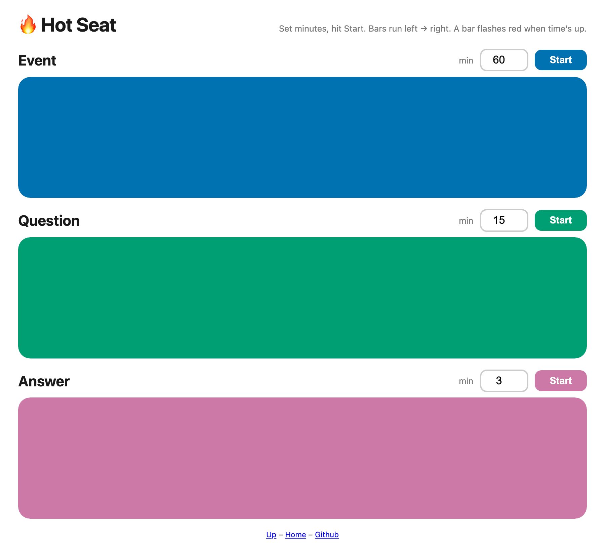

# vibes

Little side projects to solve tiny problems — simple, single-page web apps whenever possible. Quick, unmonetized tools, **100% AI-generated**.

## Projects

<table>
  <tr>
    <td width="42%" valign="top">
      
    </td>
    <td width="58%" valign="top">
      <h3><a href="https://brentozar.github.io/vibes/hot-seat-countdown/">Hot Seat Countdown</a></h3>
      

        <a href="https://brentozar.github.io/vibes/hot-seat-countdown/">Live demo</a>
        &nbsp;·&nbsp;
        <a href="hot-seat-countdown/index.html">Source</a>
      

      

        Hot seats are group sessions where someone can get up onstage, ask a question to the
        audience, and audience members can take the microphone to give their thoughts. It's
        important to keep the overall session moving forward, so this has 3 timers. By running
        all 3 timers on a projector that everyone can see, everyone's encouraged to keep passing
        the microphones around so nobody accidentally dominates the event and runs us all out of
        time.
      

      

        I used countdown bars rather than showing minutes/seconds on each one because if you show
        exact seconds, then people tend to watch the screen rather than the person talking. The
        bar color choices are driven by my part-colorblindness.
      

    </td>
  </tr>
</table>
